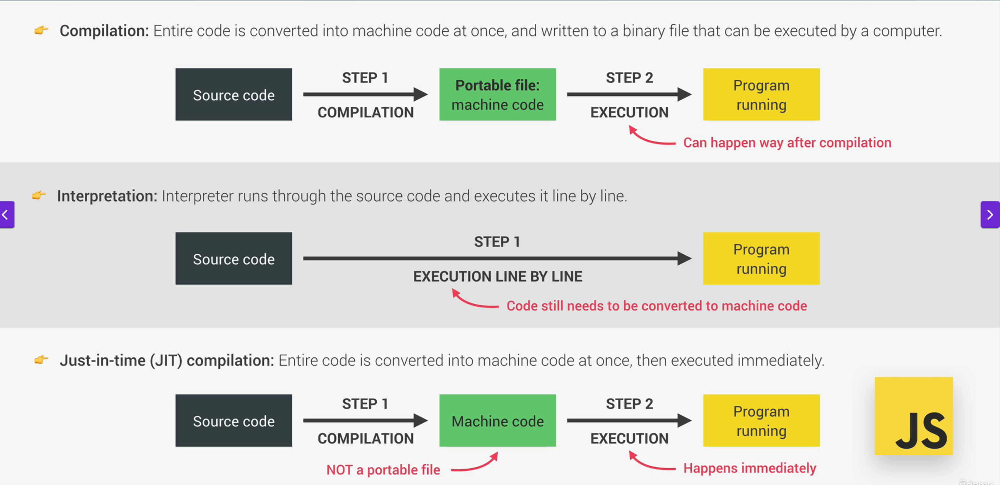
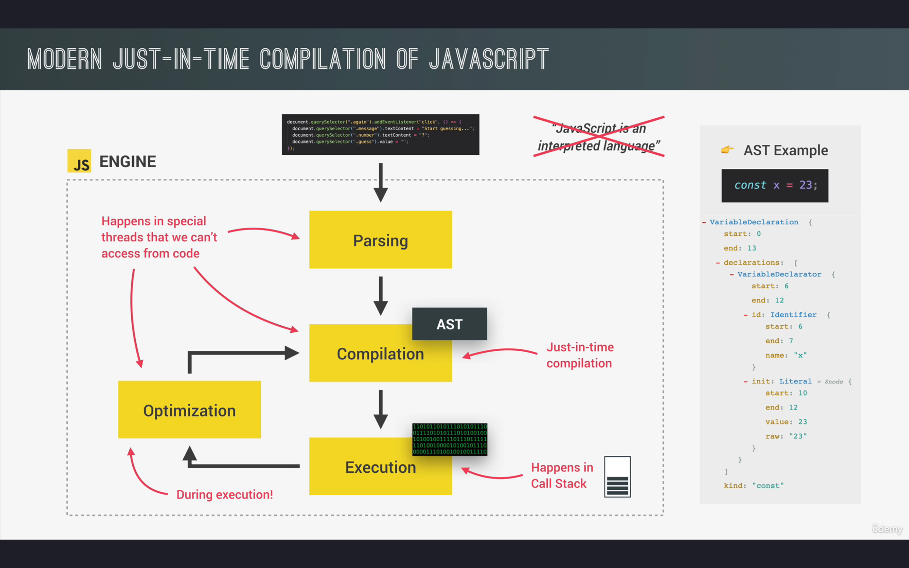
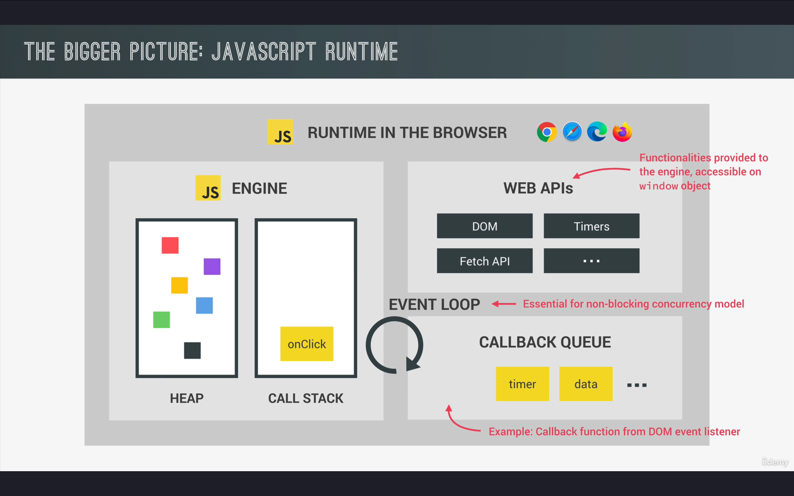

# JavaScript Engine and Runtime

## What is a JavaScript Engine?

A **JavaScript Engine** is a program that executes JavaScript code. Modern engines use **Just-In-Time (JIT) compilation** to convert JS code into machine code for efficient execution. The most well-known engine is Google's V8 (used in Chrome and Node.js), while others include SpiderMonkey (Firefox) and JavaScriptCore (Safari).

### Key Components of a JS Engine:
1. **Call Stack**  
   - Manages execution contexts in a Last-In-First-Out (LIFO) order.
   - Tracks the currently executing function/context.

2. **Memory Heap**  
   - A dynamic memory allocation space for objects, variables, and closures.
   - Handles garbage collection to free unused memory.

---

## What is a JavaScript Runtime?

A **JavaScript Runtime** is the environment that provides additional features required to execute JS programs. This includes:
- The JS Engine
- Web APIs (in browsers) or C++ APIs (in Node.js)
- Callback Queue/Task Queue
- Event Loop
- Microtask Queue (for Promises)

### Browser Runtime Example:
- **Web APIs**: DOM, Fetch API, setTimeout
- **Event Loop**: Manages async operations by checking the call stack and queues
- **Callback Queue**: Holds async callbacks (e.g., click events, HTTP responses)

### Node.js Runtime Differences:
- Uses **libuv** instead of browser Web APIs
- Includes core modules (fs, http, etc.)
- Has a different event loop implementation

---

## Key Relationship
- The **Engine** handles code execution and memory management.
- The **Runtime** provides the ecosystem for JS to interact with its environment (browser/Node.js).